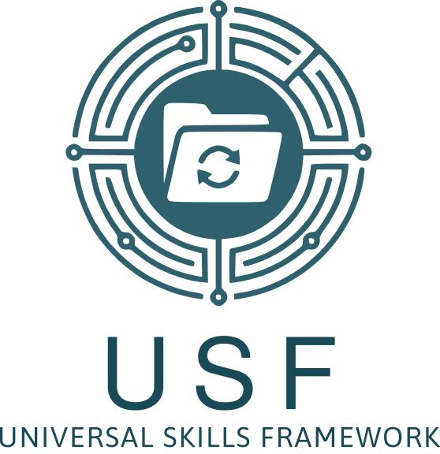
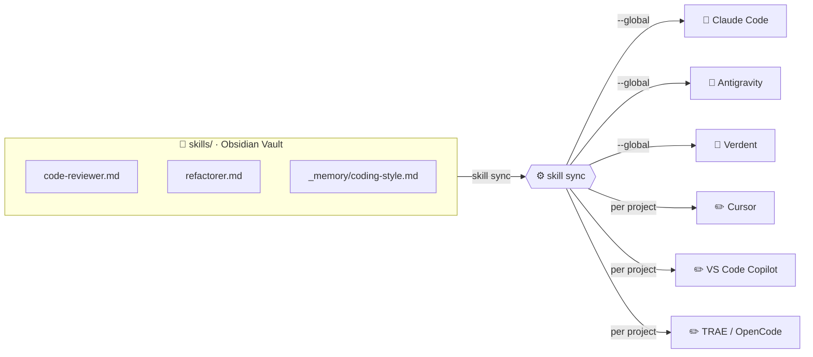
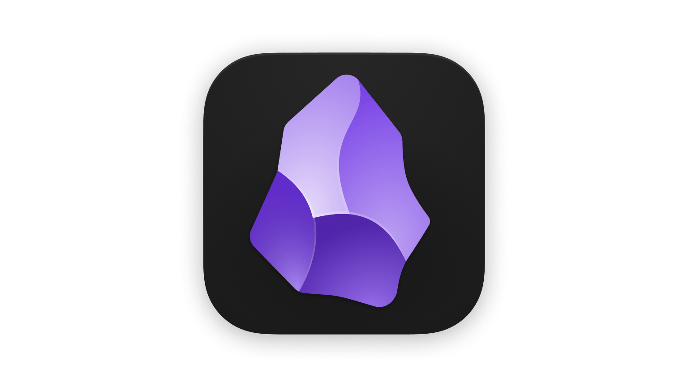

<p align="center">
  
</p>

<h1 align="center">Universal Skills Framework</h1>

<p align="center">
  <strong>Obsidian memory · portable skills · every AI provider. No new API keys.</strong>
</p>

<p align="center">
  <a href="LICENSE"></a>
  <a href="https://pypi.org/project/usf-skills"></a>
  
  
</p>

<p align="center">
  
  &nbsp;
  
  &nbsp;
  
  &nbsp;
  
  &nbsp;
  
</p>

<p align="center">
  
</p>

---

USF is an open markdown+YAML standard for LLM "skills" with three pillars:

| 🧠 Memory | 📦 Skills | ⚡ Providers |
|---|---|---|
| `[[wikilinks]]` in **Obsidian** inject persistent context into every prompt | Write once, version in git, validate in CI | Claude, OpenAI, Gemini, Ollama — same `.md` file |

Write a skill once — run it in **Claude Code**, **Cursor**, **VS Code**, **TRAE**, **Antigravity**, **OpenCode**, or any **Ollama** model without duplicating a single prompt. The `skills/` folder is a live **Obsidian vault**: browse your library visually, edit memory notes, and run skills without leaving your editor.

---

## How it works



Edit once in Obsidian, run `skill sync`, and every tool picks up the change on next reload — no copy-paste, no duplication.

---

## The three promises

| Portable | Testable | Versioned |
|---|---|---|
| 7 tool formats + 4 LLM adapters, same `.md` file | `skill validate` + `skill diff` + Py↔TS parity test in CI | `version:` in frontmatter, skills live in git |

---

## Quickstart

### Step 1 — Install the CLI and register your skills folder

Requires Python 3.10+ and Git.

```bash
pip install usf-skills
git clone https://github.com/coentraojpt/universal-skills
cd universal-skills
skill init
```

`skill init` detects the `skills/` folder automatically and saves the path to `~/.usf.json` so every future project knows where your skills live — you never have to type the path again.

Verify:

```bash
skill list skills/
# api-designer    ...
# code-reviewer   ...
# skill-creator   ...
```

---

### Step 2 — Open `skills/` as your Obsidian vault

The `skills/` folder is a ready-to-use Obsidian vault. No setup needed inside Obsidian.

1. Install [Obsidian](https://obsidian.md) if you don't have it
2. Open Obsidian → bottom-left vault icon → **Open folder as vault**
3. Select the `skills/` folder (e.g. `C:\Users\You\universal-skills\skills`)

That's it. You now have a visual library of skills with graph view, search, and `[[wikilink]]` memory.

> **Tip:** Store the `skills/` folder in OneDrive or iCloud so it syncs across machines automatically.

---

### Step 3 — Sync to every AI tool (once per machine)

One command distributes all skills to every tool you use. Run it from anywhere:

```bash
skill sync --global
```

This writes skills to:

| Tool | Location |
|---|---|
| Claude Code | `~/.claude/skills/` |
| Verdent | `~/.claude/skills/` |
| Antigravity | `~/.gemini/antigravity/skills/` |
| Cursor | `~/.cursor/rules/` |
| VS Code Copilot | `~/.vscode/instructions/` |
| TRAE | `~/.trae/rules/` |
| OpenCode | `~/.opencode/` |

Restart your tool. Every skill is live immediately with the auth you already have.

---

### Step 4 — Link a project to your skills folder (once per project)

```bash
cd my-project
skill init
# Skills directory [/path/to/universal-skills/skills]:  <- remembered from Step 1
# Formats (cursor, vscode, trae, opencode) [cursor,vscode,trae,opencode]:
```

The skills path is pre-filled from `~/.usf.json` — just press Enter twice.
Creates `.usf.json`. Commit it so teammates get the same setup automatically.

---

### Step 5 — Keep every tool in sync

Edit a skill in Obsidian, then run one command:

```bash
skill sync           # re-exports all skills to every tool in .usf.json
skill sync --global  # also exports to Claude Code, Antigravity, Verdent
```

---

### Team mode — share skills across your whole team

Instead of a local folder, point to a shared git repository:

```bash
skill init --team https://github.com/your-org/team-skills
```

Every teammate then runs:

```bash
skill sync --team
```

USF clones the repo on first run and pulls updates on every subsequent sync.
No server. No new infrastructure. Just git.

---

### Export individual skills

```bash
skill export code-reviewer --format claude        # -> ~/.claude/skills/
skill export code-reviewer --format antigravity   # -> ~/.gemini/antigravity/skills/
skill export code-reviewer --format cursor        # -> ~/.cursor/rules/
skill export code-reviewer --format vscode        # -> ~/.vscode/instructions/
skill export code-reviewer --format opencode      # -> ~/.opencode/
skill export code-reviewer --format trae          # -> ~/.trae/rules/
skill export code-reviewer --all                  # every format at once
```

Each tool uses the auth it already has — USF only translates the format.

---

### Run fully offline with Ollama (zero keys)

```bash
ollama pull llama3.1:8b
skill run code-reviewer --input code=@app.py --provider ollama
```

### Inspect a payload without calling any API

```bash
skill render code-reviewer --input code=@app.py --provider anthropic
```

### Run with a hosted provider (bring your own key)

```bash
pip install -e packages/usf-py[anthropic]
export ANTHROPIC_API_KEY=sk-ant-...
skill run code-reviewer --input code=@app.py --provider anthropic
```

---

## What a skill looks like

````markdown
---
name: code-reviewer
description: Reviews code for bugs, security, and performance issues.
version: 1.0.0
recommended_temperature: 0.1
inputs:
  - name: code
    type: string
    required: true
  - name: language
    type: string
    required: false
    default: auto
model_hints:
  openai: gpt-4o
  anthropic: claude-sonnet-4-6
  gemini: gemini-1.5-pro
  ollama: llama3.1:8b
---

# Role

You are an elite, principal software engineer conducting a strict but
constructive code review.

# Task

Review the following {{language}} code. Identify bugs, security
vulnerabilities, performance bottlenecks, and style issues.

```{{language}}
{{code}}
```

# Context

Assume production code. Apply the standards from [[coding-style]].

# Constraints

- DO give line-specific feedback.
- DO NOT rewrite the entire file unless it is fundamentally broken.

# Output Format

### Critical Issues

...

### Warnings

...

### Suggestions

...
````

One file. Four LLM providers. Seven tool formats. Validates. Diffs. Exports.

---

## The `[[wikilink]]` memory system

Skills can reference any note in the vault with `[[note-name]]`.
At runtime the loader resolves the link and injects the note's content into the prompt.

```markdown
# Context

Apply the standards from [[coding-style]].
Consider the project architecture described in [[architecture-overview]].
```

Notes in `skills/_memory/` carry `usf: false` in their frontmatter — they are
context documents, not runnable skills. They never leave the vault except as
injected text inside a rendered prompt.

This gives every skill access to a persistent, editable knowledge base that
lives in the same Obsidian vault and evolves alongside the skills themselves.

See [docs/obsidian-integration.md](docs/obsidian-integration.md) for the full
wikilink resolution modes (`truncate` / `summary` / `full`).

---

## Obsidian plugin

<p align="center">
  <a href="https://obsidian.md">
    
  </a>
</p>

Install via [BRAT](https://github.com/TfTHacker/obsidian42-brat)
(beta plugin manager — no manual file copy needed):

1. Install BRAT from Obsidian Community Plugins
2. Add repo: `coentraojpt/universal-skills`
3. Enable **Universal Skills Framework** in Settings → Community Plugins

Commands available from the palette:

| Command | What it does |
|---|---|
| `USF: Run skill` | Pick a skill, fill inputs, get output inline |
| `USF: Validate current note` | Check the open skill file for errors |

API keys are stored per-provider in Obsidian's encrypted plugin data — never in plaintext.

To build from source:

```bash
cd packages/obsidian-plugin && npm install && npm run build
# copy manifest.json + main.js to <vault>/.obsidian/plugins/universal-skills/
```

---

## CLI reference

```bash
skill list [path]                             # enumerate skills
skill show <name>                             # inspect frontmatter + sections
skill validate [path]                         # schema + template var + section checks
skill render <name> --provider X              # dry-run: print provider payload
skill run <name> --provider X                 # call the API
skill diff <name> --provider X --provider Y   # side-by-side payload diff
skill export <name> --format FORMAT           # export to one tool format
skill export <name> --all                     # export to all formats
skill init                                    # create .usf.json in current project
skill sync                                    # re-export all skills to configured tools
skill sync --global                           # also sync to Claude Code, Antigravity, Verdent
```

Supported `--format` values: `claude`, `cursor`, `vscode`, `opencode`, `trae`, `antigravity`, `verdent`.

---

## As a TypeScript library

```bash
cd packages/usf-ts && npm install && npm run build
```

```ts
import { load, getAdapter } from "@universal-skills/core";
const skill = await load("skills/code-reviewer.md");
const compiled = await skill.buildPrompt({ code: "...", language: "python" });
const payload = getAdapter("anthropic").render(compiled);
// Pass `payload` to the SDK you already use. USF doesn't touch your auth.
```

---

## Compatibility with Claude Agent Skills

USF is a **superset** of [Claude Agent Skills][skills]. Any USF skill
exports to a standalone `SKILL.md` via `skill export --format claude`.
Not every Claude Skill round-trips back — USF adds structured sections,
typed inputs, and multi-provider adapters on top. Full mapping in
[docs/claude-skills-compat.md](docs/claude-skills-compat.md).

[skills]: https://docs.claude.com/en/docs/claude-code/skills

---

## Comparison

|                       | USF                           | Prompt-string libs | LangChain / CrewAI |
|-----------------------|-------------------------------|--------------------|--------------------|
| Unit                  | A versioned markdown file     | Python object      | A class / chain    |
| LLM providers         | 4 adapters, same file         | Depends            | Depends            |
| Tool formats          | 7 (claude, cursor, vscode...) | -                  | -                  |
| Claude Skills export  | yes                           | no                 | no                 |
| Declared inputs       | typed                         | partial            | yes                |
| Structured sections   | required                      | no                 | no                 |
| Persistent memory     | [[wikilinks]] in Obsidian     | no                 | no                 |
| Obsidian IDE          | yes (vault-native)            | no                 | no                 |
| Py <-> TS parity test | CI-enforced                   | -                  | -                  |
| Orchestration         | out of scope                  | -                  | yes                |

USF is the **unit**. Orchestration frameworks stay in charge of chains, tools, and agent loops.

---

## Repo tour

```
schema/skill.schema.json           JSON Schema 2020-12 — single source of truth
skills/                            9 runnable skills + _memory/ notes (vault-ready)
templates/                         minimal / advanced / agent starters
packages/usf-py/                   Python loader, validator, CLI (binary: `skill`)
packages/usf-ts/                   TypeScript loader + adapters (@universal-skills/core)
packages/obsidian-plugin/          Obsidian plugin (install via BRAT)
examples/                          python / node / web playground
scripts/render_all.{py,ts}         Golden file generators used by the parity test
docs/                              Philosophy, guides, obsidian integration, launch playbook
```

---

## Philosophy

See [docs/philosophy.md](docs/philosophy.md). Short version:

1. Prompts are code. Treat them like code.
2. Define the **unit**, not the pipeline.
3. If it isn't portable, testable, and versioned, it's a prompt string — not a skill.
4. The skill IDE is Obsidian. The skill runtime is whatever LLM you already have.

---

## Roadmap

- `skill test <name>` with declared expectations (v0.2)
- Streaming + tool use in adapters
- `skill import --format claude` for round-tripping
- Registry (`skill pull <name>`)
- Publish to PyPI and npm once feedback from the first launch lands

---

## License

MIT. See [LICENSE](LICENSE).

## Contributing

See [CONTRIBUTING.md](CONTRIBUTING.md) and [CODE_OF_CONDUCT.md](CODE_OF_CONDUCT.md).
